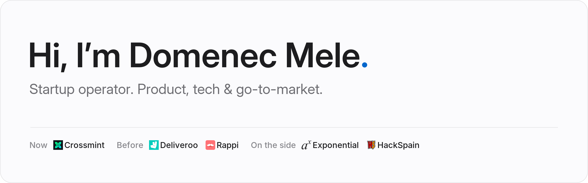

<a href="https://mele.dev">
  <picture>
    <source media="(prefers-color-scheme: dark)" srcset="assets/banner-dark.png">
    
  </picture>
</a>

 
 

Since I was a kid, I’ve felt great curiosity for computing, coding and building. Now I’m a startup operator.

 

 &nbsp;**Now** — Product, Tech and Go-to-market at [Crossmint](https://crossmint.com), where my day-to-day is a lot of data infra: BigQuery, dbt, everything data.

  &nbsp;**Before** — building products around the globe at category-defining startups like [Deliveroo](https://deliveroo.com) and [Rappi](https://rappi.com).

<picture><source media="(prefers-color-scheme: dark)" srcset="assets/logos/goexponential.org.png"></picture> &nbsp;**On the side** — sending Spanish wiz-kids to intern at top-tier US startups like
 [Ramp](https://ramp.com),
 [Clay](https://clay.com),
<picture><source media="(prefers-color-scheme: dark)" srcset="assets/logos/stack-ai.com.png"></picture> [StackAI](https://stack-ai.com) or
 [Krea](https://krea.ai)
via the [Exponential Fellowship](https://goexponential.org).

 &nbsp;**Also** — I’m part of the team organizing [HackSpain](https://hackspain.com), a 36-hour hackathon for builders under 30 in Madrid.

 
 

### Toolbox

What I reach for day to day — from data infra at work to the Docker box under my desk.

 

<picture>
  <source media="(prefers-color-scheme: dark)" srcset="assets/toolbox-dark.png">
  
</picture>

 
 

### Shipping

The last year on GitHub — most of it in private repos.

 

<picture>
  <source media="(prefers-color-scheme: dark)" srcset="https://raw.githubusercontent.com/dumenac/dumenac/output/github-snake-dark.svg">
  
</picture>

 
 

### Say hi

Happy to talk startups, data, hackathons or Linux desktops.

 

 
 

psst

 
<code>↑ ↑ ↓ ↓ ← → ← → B A</code> — now try it on <a href="https://mele.dev">mele.dev</a>.

